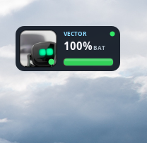
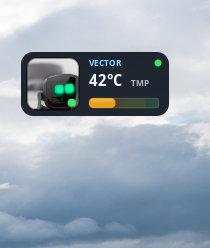
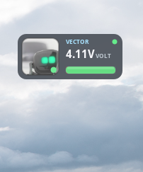
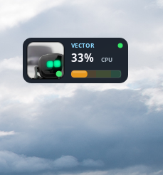
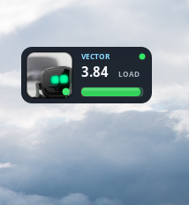

# Vector Status Widget

Floating taskbar-style gauge that **appears when Vector is online** and **hides when offline**.

## Screenshots

| Battery | Temperature | Voltage |
|---------|-------------|---------|
|  |  |  |

| CPU | Load |
|-----|------|
|  |  |

Left-click cycles **BAT → TMP → VOLT → CPU → LOAD**.

## Features

| Feature | Detail |
|---------|--------|
| Online-only | Shows when engine stats (`:8888`) are reachable |
| Meters | Left-click cycles **BAT → TMP → VOLT → CPU → LOAD** |
| Tray icon | Always present (green online / grey offline) |
| Drag to move | Position saved under `~/.config/vector-status/` |
| Autostart | Starts at login after install |
| Single instance | File lock prevents duplicate widgets |

Battery % is derived from voltage (same curve as Vector’s `vs` script). CPU and LOAD need an optional SSH unlock key — battery/temp/voltage work without it.

## Requirements

- Debian / Ubuntu / Raspberry Pi OS (or similar with `apt`)
- Python 3 + GTK 3 + PyGObject + Cairo
- Ayatana AppIndicator + gtk-layer-shell
- Vector on **[wire-pod](https://github.com/kercre123/wire-pod)** (or a known IP)
- Network access to Vector `IP:8888`

Dependencies are installed automatically by `install.sh`. wire-pod itself is **not** installed by this package.

## Install

```bash
cd vector-status
sudo ./install.sh
```

The installer asks for your Vector SSH unlock key (for CPU / LOAD). You can skip it; BAT / TMP / VOLT still work.

Options:

```bash
sudo PREFIX=/usr ./install.sh
sudo INSTALL_USER=alice ./install.sh
sudo VECTOR_SSH_KEY=/path/to/ssh_root_key ./install.sh   # non-interactive
sudo SKIP_SSH_KEY=1 ./install.sh                         # skip the prompt
```

Start:

```bash
vector-status &
# or Applications → Vector Status
```

## Controls

| Action | Result |
|--------|--------|
| **Left-click** | Cycle BAT → TMP → VOLT → CPU → LOAD |
| **Drag** | Move anywhere (saved) |
| **Right-click** | Menu (refresh, reset position, quit) |

Widget **hides** when Vector is offline and **shows** again when online.

## Configuration

Saved under `~/.config/vector-status/`:

| File | Purpose |
|------|---------|
| `position.txt` | Last x,y of the gauge |
| `mode.txt` | Last meter (BAT / TMP / VOLT / CPU / LOAD) |
| `ip.txt` | Optional Vector IP override |
| `face.png` | Optional face-image override |
| `ssh_root_key` | Optional Vector unlock key (CPU / LOAD only) |

If auto-discovery fails:

```bash
echo 192.168.x.x > ~/.config/vector-status/ip.txt
```

### How online is decided

1. IP from (in order): `ip.txt` → wire-pod `botSdkInfo.json` → `~/.anki_vector/sdk_config.ini`
2. TCP connect to `IP:8888`
3. Fetch `getenginestats` (same source as Vector’s `vs` script)

If that works → widget **shows**. Otherwise → widget **hides**.

### Optional SSH (CPU / LOAD)

CPU and load meters SSH into Vector as `root`. The key is **not** included in this package.

`sudo ./install.sh` prompts for the path to your unlock key and copies it to `~/.config/vector-status/ssh_root_key` (mode 600). You can skip the prompt.

To add or replace a key later:

```bash
cp /path/to/ssh_root_key ~/.config/vector-status/ssh_root_key
chmod 600 ~/.config/vector-status/ssh_root_key
```

The widget also accepts:

- `~/.anki_vector/ssh_root_key`
- `~/.ssh/id_rsa_vector`
- `export VECTOR_SSH_KEY=/path/to/your/key`

Without a key, BAT / TMP / VOLT still work.

## Uninstall

```bash
sudo ./uninstall.sh
```

Leaves `~/.config/vector-status/` unless you delete it.

## Share

```bash
./pack.sh
# → ../vector-status-1.0.0.tar.gz
```

Others can unpack and run `sudo ./install.sh`.

## License

MIT — see `LICENSE`.
wire-pod and Vector are separate projects with their own licenses.
